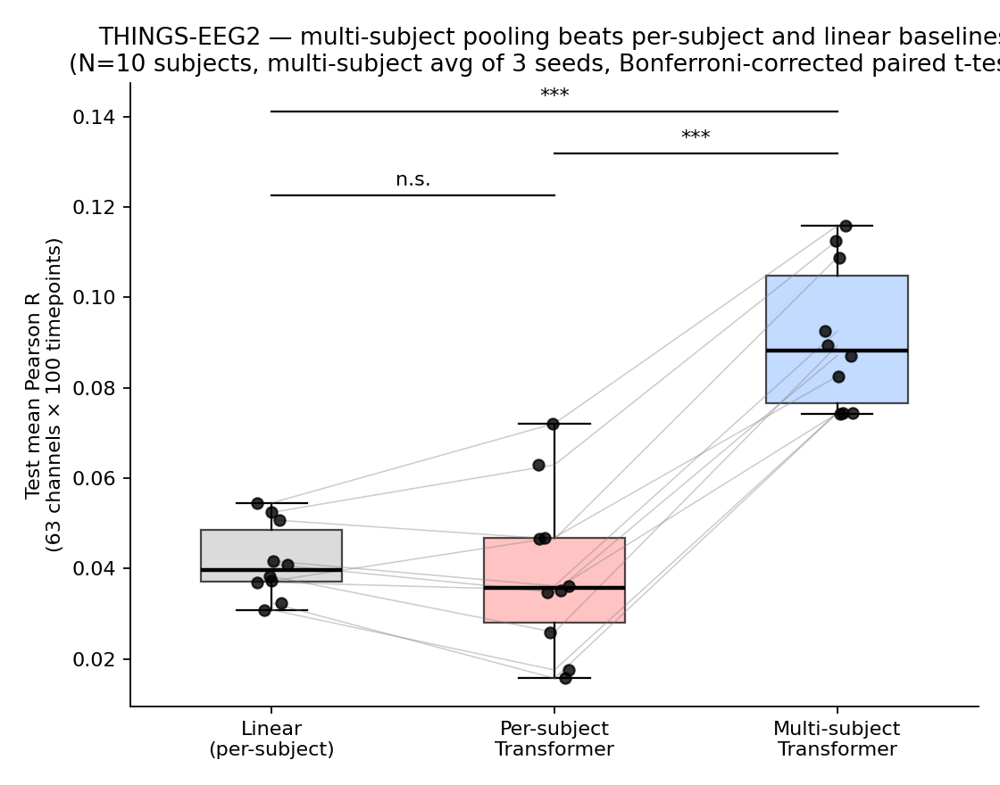
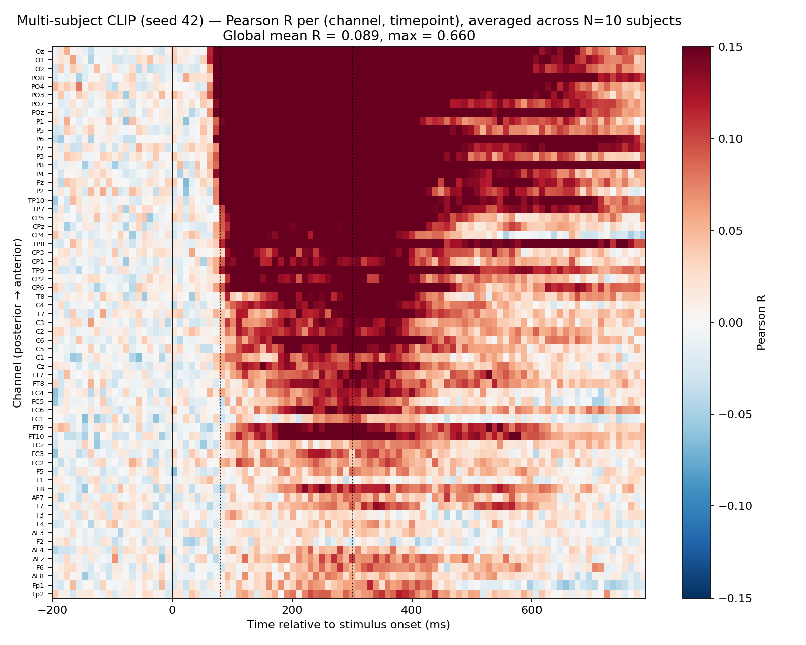
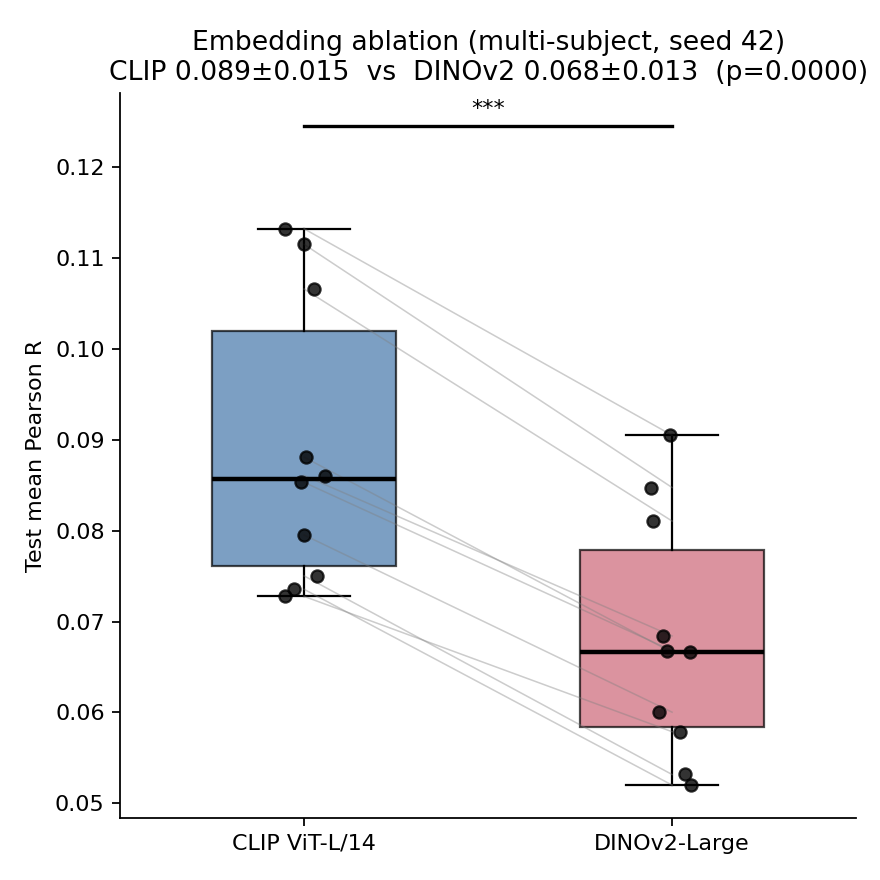
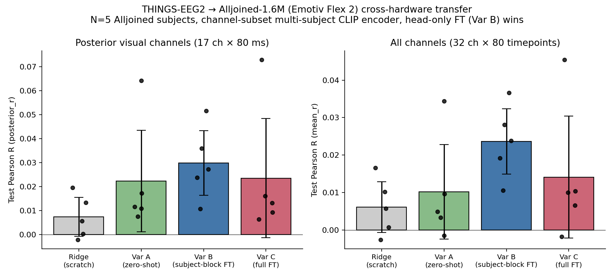

```{python}
#| label: setup
#| include: false
from pathlib import Path
import sys

# The QMD is designed to live in report/, with results/, logs/, figures/, and
# embeddings/ as sibling directories. This setup also works if Quarto is invoked
# from the project root via `quarto render report/writeup.qmd`.
cwd = Path.cwd().resolve()
for candidate in (cwd, cwd / "report", cwd.parent / "report"):
    if (candidate / "report_metrics.py").exists():
        sys.path.insert(0, str(candidate))
        break

from report_metrics import (
    compute_report_context,
    fmt_int,
    render_ablation_text,
    render_artifact_note,
    render_main_results_text,
    render_main_table,
    render_transfer_table,
    render_transfer_text,
)

project_root = cwd.parent if (cwd.parent / "results").exists() else cwd
ctx = compute_report_context(project_root)
shapes = ctx["shapes"]
```

# In plain English {.unnumbered}

We were curious about a specific trick from the TRIBE v2 paper [@tribev2]: instead of fitting a separate brain model per participant, TRIBE trains a single transformer on *all* participants at once and routes each subject through their own learned linear readout block. That trick lets the shared backbone benefit from many people's data while still respecting individual differences. TRIBE used it to predict slow fMRI responses to multimodal stimuli; we wanted to know whether the same recipe is useful for fast, noisy event-related EEG, where per-subject datasets are usually too small to feed a modern architecture.

To test that, we built a small TRIBE-style model on THINGS-EEG2 [@thingseeg2] — 10 subjects, 16,540 training images, 200 test images, 100 Hz EEG over a one-second post-stimulus window. The architecture is a 4-layer transformer over CLIP ViT-L/14 image embeddings [@clip] with a per-subject linear readout, plus one small addition: an 11-token RSVP "context window" so each predicted EEG response sees the five preceding and five following image embeddings, since THINGS-EEG2 is collected as a rapid serial visual presentation stream. We then asked a second question that TRIBE itself does not address: does the trained encoder transfer across EEG hardware? We adapted the model to Alljoined-1.6M [@alljoined], a recently released companion dataset that records the same THINGS-EEG2 images on a $2.2k consumer-grade 32-channel Emotiv Flex 2 system. Two findings emerged. First, multi-subject pooling roughly doubles average per-channel-time Pearson correlation versus both a linear baseline and a per-subject transformer on THINGS-EEG2, and the result replicates tightly across three random seeds. Second — the part we find most interesting — the encoder transfers across hardware: with the THINGS-EEG2 encoder *frozen* and only a fresh subject-readout block trained on Alljoined, posterior correlation is roughly four times the from-scratch ridge baseline. The transfer is preliminary because we only ran it on five of Alljoined's twenty subjects, but the paired test against scratch ridge already reaches $p\approx 0.03$.

# Introduction

Predicting brain responses to natural stimuli from pretrained foundation-model embeddings has become a useful test bed for studying how machine representations align with biological ones. Most existing work, including TRIBE v2 [@tribev2], operates on slow but spatially rich fMRI. EEG is the opposite regime: high temporal resolution, low signal-to-noise per trial, and small per-subject sample counts after rep averaging. This combination has historically forced researchers to fit one model per participant, which limits the architectures that can be used without overfitting. Our project asks whether the central trick of TRIBE v2 — a *subject-conditioned transformer trained jointly across all participants*, with a per-subject linear readout block — survives the move from fMRI to event-related EEG, and whether it produces representations that are reusable across very different recording hardware.

We test the following hypothesis:

> A subject-conditioned multi-subject transformer trained on fixed pretrained visual embeddings will predict image-evoked EEG more accurately than per-subject or linear baselines, and the resulting encoder will transfer to a different EEG headset with only a lightweight subject-head fine-tune.

The novel architectural detail compared to TRIBE v2 is an *RSVP context window*: each predicted EEG epoch is conditioned not only on its own image embedding but also on the five preceding and five following image embeddings as transformer context, mirroring the structure of the THINGS-EEG2 rapid serial visual presentation paradigm. Two design choices are also load-bearing for the transfer experiment, both folded into Phase 5 of our pipeline so that Phase 7 transfer is possible without retraining: subject identity is dropped to a "null subject" pathway with probability $p\approx 0.1$ during training (so the model has explicit experience predicting for an unseen subject), and the channel-restricted encoder used for transfer is trained on the same 32-channel intersection of THINGS-EEG2's BioSemi 64 montage and Alljoined's Emotiv Flex 2 montage that the transfer evaluation uses.

# Related Work

**Foundation-model encoding of brain activity.** TRIBE v2 frames brain modeling as an *encoding* problem rather than a decoding one: pretrained multimodal representations are mapped onto recorded brain activity, with subject-specific linear blocks accounting for individual variation [@tribev2]. We adopt this framing directly. The change is the measurement modality, from fMRI BOLD to event-related EEG, which makes the task a useful stress test for whether multi-subject foundation-model encoding generalizes outside of slow hemodynamic regimes.

**Visual EEG benchmarks.** THINGS-EEG2 [@thingseeg2] is the standard benchmark for modeling visual object recognition from EEG. It contains 10 participants, 82,160 trials per participant across 16,740 image conditions, and image-level train/test splits with repeated-trial averaging that bring per-image SNR within range of large-scale modeling. Alljoined-1.6M [@alljoined] was released specifically to enable cross-hardware studies of this kind: 20 participants viewed the THINGS-EEG2 stimulus family on a 32-channel consumer-grade Emotiv Flex 2 system. Because the stimulus family is shared, our pretrained image embeddings can be reused across the two datasets without modification.

**Pretrained visual embeddings.** We compare two widely used pretrained image encoders. CLIP ViT-L/14 [@clip] learns visual features through image-text contrastive supervision and is known to encode strong category-level semantic structure. DINOv2-Large [@dinov2] learns general-purpose image features without language supervision and is a strong self-supervised vision baseline. The comparison is informative for the encoding question: if CLIP wins, the relevant EEG signal is closer to language-aligned semantic structure; if DINOv2 wins, it is closer to low-level perceptual structure.

**Transformer backbone.** All multi-subject and per-subject models in this work use the standard pre-norm transformer encoder [@transformer], over an 11-token positional grid representing the RSVP context window.

# Methods

## Data and preprocessing

For THINGS-EEG2 we used the publicly released preprocessed EEG epochs for 10 subjects. Each per-subject training array contains repeated responses to `{python} fmt_int(shapes["clip_train"][0])` images, and each test array contains repeated responses to `{python} fmt_int(shapes["clip_test"][0])` held-out images. The recordings are at 100 Hz over a $[-0.2, 0.79]$ s window relative to stimulus onset. We excluded the stimulus-marker channel, averaged across repeated presentations, and modeled the remaining EEG as a channel-by-time matrix. For the full THINGS-EEG2 experiments this produced `{python} shapes["things_r_per_ct"][0]` EEG channels and `{python} shapes["things_r_per_ct"][1]` time samples per image, so each prediction target is $Y \in \mathbb{R}^{C \times T}$.

Image features were extracted once and kept fixed. We used CLIP ViT-L/14 embeddings of dimension `{python} shapes["clip_train"][1]` and DINOv2-Large CLS embeddings of dimension `{python} shapes["dinov2_train"][1]`. The cached embedding tensors have shapes `{python} shapes["clip_train"]` / `{python} shapes["clip_test"]` for CLIP and `{python} shapes["dinov2_train"]` / `{python} shapes["dinov2_test"]` for DINOv2, matching the train/test image counts. The 90/10 train/validation split is taken at the *concept* level, so no image concept appears in both training and validation splits.

For Alljoined transfer we used the first `{python} ctx["transfer"]["ridge"]["n"]` available subjects. The Alljoined recording window is post-stimulus and at a higher sampling rate than THINGS-EEG2, so we adapt each subject's data to the THINGS-EEG2 model input by averaging repeated trials per image, cropping to the post-stimulus window, resampling to `{python} shapes["alljoined_r_per_ct"][1]` post-stimulus timepoints, reordering channels to the `{python} shapes["alljoined_r_per_ct"][0]`-channel intersection with THINGS-EEG2, and prepending a zero baseline so the input shape matches the model's expected pre-stimulus segment. All Alljoined correlations reported below are computed only on the 80 post-stimulus timepoints, never on the synthetic zero baseline.

## Channel spaces

Three channel configurations are used in this report and must be distinguished. The main THINGS-EEG2 model is trained on the 63 EEG channels available after removing the stimulus-marker channel. An auxiliary 28-channel posterior-heavy mask was used as an in-domain ablation that focuses model capacity on visually responsive sensors. Cross-hardware transfer uses the *true* 32-channel THINGS-EEG2 / Alljoined intersection: `Cz, FCz, AFz, Fp1/2, F1/2/5/6, CP1/2/3/4/5/6, P1/2/3/4/5/6/7/8, Pz, PO3/4/7/8, POz, O1/O2/Oz`. This intersection was verified directly from the downloaded Alljoined sub-01 channel list rather than copied from the dataset paper; the paper appendix listed a different montage than the actual files contain. Only the 32-channel intersection model is used for the Alljoined transfer results.

## Models

All transformer models share the same backbone: a `Linear(D_emb \to 384)` stem with LayerNorm, learned positional embeddings over 11 tokens, and four pre-norm transformer encoder layers with six attention heads, $d_{\text{model}}=384$, FFN dimension 1536, GELU, and dropout 0.1 [@transformer]. The 11-token context contains the target image embedding plus the five previous and five following image embeddings within the RSVP stream, with zero-padding at session boundaries. The encoder output at the target-token position is denoted $h \in \mathbb{R}^{384}$.

The **multi-subject** model adds a subject-indexed linear readout. Let $W \in \mathbb{R}^{(N+1) \times CT \times 384}$ and $b \in \mathbb{R}^{(N+1) \times CT}$ be the readout parameters, where $N$ is the number of training subjects. The prediction for subject $s$ is

$$
\hat{Y}_{s} = \operatorname{reshape}(W_s\, h + b_s,\; C,\; T).
$$

The final readout block (index $N$) is a *null-subject pathway*. During training, the true subject id is replaced with the null index with probability $p\approx 0.1$. This subject-dropout step is what makes Phase 7 zero-shot transfer architecturally possible: the null pathway has been explicitly trained to predict EEG when subject identity is unknown, so it can be applied to an unseen Alljoined subject without any new gradients. The **per-subject transformer** uses the same backbone and a single $\operatorname{Linear}(384\to CT)$ head, trained independently on each subject. The **linear baseline** is a per-subject ridge / linear head from the image embedding directly to the flattened EEG, with no transformer between them.

## Training and evaluation

All transformer models were trained with AdamW (learning rate $10^{-4}$, weight decay 0.01, cosine schedule with 5% warmup), batch size 64, up to 30 epochs, with early stopping on validation Pearson correlation (patience 5). The headline multi-subject CLIP result averages three independent random seeds: `{python} ", ".join(ctx["things"]["seed_variants"])`. The primary evaluation metric is Pearson correlation between predicted and observed EEG, computed per channel-time cell over the held-out 200 test images and then averaged over cells and over subjects. For Alljoined we report both the all-cell correlation and the *posterior-channel* correlation; we treat posterior correlation as the primary transfer headline because the visual evoked response is concentrated over parietal and occipital sensors and the all-cell mean is diluted by frontal channels that carry little image-locked signal at this hardware quality.

For cross-hardware transfer we initialize from the 32-channel THINGS-EEG2 intersection model and compare four protocols on each Alljoined subject. **Scratch ridge** is a per-subject ridge regression directly from CLIP embeddings to flattened Alljoined EEG, trained from random initialization. **Variant A (zero-shot)** routes the Alljoined subject through the null-subject pathway with no Alljoined training. **Variant B (frozen encoder + subject block)** freezes the entire transformer backbone and trains only a fresh subject-readout block, initialized from the mean of the 10 trained THINGS-EEG2 subject blocks, for 5 epochs. **Variant C (full fine-tune)** unfreezes the entire model and trains for one epoch at $\text{lr}=10^{-5}$.

# Results

## Multi-subject pooling improves THINGS-EEG2 prediction

```{python}
#| label: main-results-text
#| output: asis
print(render_main_results_text(ctx))
```

```{python}
#| label: main-results-table
#| output: asis
print(render_main_table(ctx))
```

```{python}
#| label: ablation-text
#| output: asis
print(render_ablation_text(ctx))
```

{#fig-headline width="68%"}

{#fig-heatmap width="78%"}

{#fig-embedding width="60%"}

## Cross-hardware transfer to Alljoined-1.6M

```{python}
#| label: transfer-text
#| output: asis
print(render_transfer_text(ctx))
```

```{python}
#| label: transfer-table
#| output: asis
print(render_transfer_table(ctx))
```

The most conservative reading of the transfer numbers is that they are promising but not yet definitive. Variant B's posterior correlation is roughly four times the scratch ridge baseline, which is the clearest signal in the table, but the comparison is across only five of Alljoined's twenty subjects and we ran four transfer variants per subject. We therefore treat Variant B as evidence that the multi-subject THINGS-EEG2 encoder learned hardware-transferable visual representations, rather than as a final claim about consumer-grade BCI reliability.

{#fig-transfer width="82%"}

# Discussion, Conclusions, and Future Work

The headline result on THINGS-EEG2 supports the central hypothesis: a subject-conditioned multi-subject transformer substantially outperforms both a per-subject linear baseline and a per-subject transformer with the same backbone. This is the cleanest finding of the project. The per-subject transformer's failure to beat linear is itself informative — it is consistent with TRIBE's argument that modern architectures are data-starved when restricted to one subject's training set, and that the *value* of the multi-subject recipe is precisely that it pools enough samples to make a transformer pay off. The CLIP-versus-DINOv2 comparison points the same way: language-aligned semantic embeddings predict averaged event-related EEG better than purely self-supervised visual embeddings, suggesting that what survives trial averaging is closer to category-level semantics than to low-level image statistics.

The cross-hardware transfer result is the part of the project we find most novel-relative-to-TRIBE. The original TRIBE v2 paper does not study transfer across recording modalities or hardware. Our preliminary five-subject result on Alljoined-1.6M shows that, with the THINGS-EEG2 encoder *frozen*, training only a fresh per-subject linear readout block raises posterior Pearson correlation roughly four-fold over a from-scratch ridge baseline, with a paired-t $p$ near $0.03$ even at $N=5$. The two design choices that make this work — null-subject dropout during multi-subject training, and training the transferable model on the same 32-channel TS2 / Alljoined intersection that the transfer evaluation uses — were folded into Phase 5 specifically so that no retraining was needed for Phase 7. Variants A (zero-shot through the null pathway) and C (full fine-tune at $\text{lr}=10^{-5}$ for one epoch) trend positive but are not significant at $N=5$; Variant C in particular is high-variance and would likely benefit from per-subject early stopping or low-rank adaptation rather than a one-pass full fine-tune.

The work has three main limitations. First, the Alljoined transfer evaluation is preliminary at five of twenty subjects; replicating the Variant B advantage on the full twenty is the obvious next step and would also tighten Variants A and C, which are currently underpowered. Second, the Alljoined recording window has no pre-stimulus baseline; we zero-pad to match the THINGS-EEG2 model's expected 100-timepoint input, which is a slight input-distribution mismatch — Variant B's encoder is frozen, so this mismatch is absorbed into the readout, but a learned baseline-imputation step would be cleaner. Third, the per-subject transformer comparison is in some sense unfair: the architecture is too large for one subject's data, and a smaller per-subject transformer might close the gap. Future directions include extending Variant B to all 20 Alljoined subjects, adding a low-rank adaptation variant in place of full fine-tuning, comparing the multi-subject encoder against stronger spatiotemporal baselines such as regularized temporal response functions, and evaluating the encoder on out-of-THINGS image distributions to probe what generalizable visual structure the multi-subject backbone has actually captured.

# References
